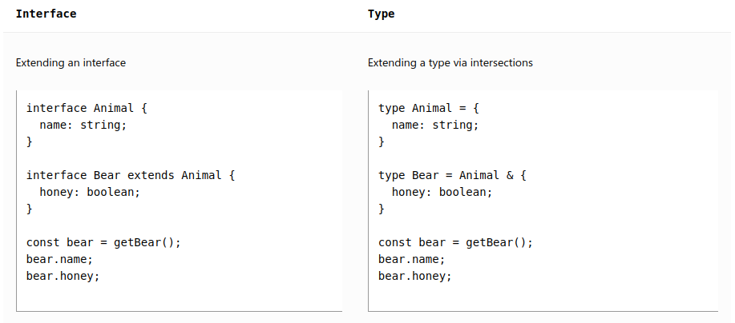
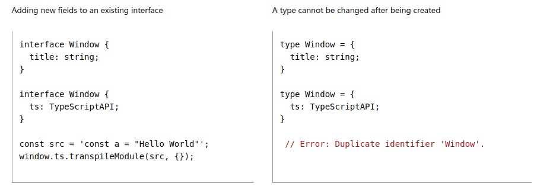

# TypeScript 🦅

- TypeScript adds additional syntax to JavaScript to support a tighter integration with your editor.

- Catch errors early in your editor.

- Provides better auto-completion and code navigation.

- TypeScript is a superset of JavaScript.

```diff
- Remember, typescript can't run in the browser, it needs to be transpiled to JavaScript. 💀

- But, node.js can run typescript. But, it's still recommended to transpiled it to JavaScript. 🤓

+ TypeScript is a superset of JavaScript, so any valid JavaScript code is also valid TypeScript code. 🥳
```

### Compile Vs Transpile

Compile and transpile are two terms used in programming to describe the process of converting code from one language to another.

- `Compiling is the process of converting code from a high-level language to a low-level language`. The high-level language is easier for humans to read and write, while the low-level language is closer to the machine code that the computer can understand.

- `Transpiling is the process of converting code from one high-level language to another`. The target language is typically a newer version of the original language, or a language that is better suited for a particular platform.

---

## Installation

```bash
sudo npm install -g typescript
```

---

## Running a simple typescript file using node

- Create a file called `hello.ts` and add the following code:

```ts
console.log("Hello World");
```

- To run the file using `node`, use the following command:

```bash
tsc hello.ts # transpile the typescript file to javascript
node hello.ts # run the javascript file
```

---

## Types Vs Interfaces
```diff
- **Prefer `interface` over `type` when possible**.
```
- Type aliases and interfaces are very similar and in many cases you can choose between them freely.

- Almost all features of an interface are available in type, the key distinction is that `a type cannot be re-opened to add new properties` vs `an interface which is always extendable`.

- If you're in a React codebase, `prefer interface` until you need to use features from `type`.

- If you would like to `describe the shape of an object`, use an `interface`.

- If you would like to `describe the shape of a function`, use a `function type`.

- If you would like to `describe the shape of any other value`, use a `type`.

- If you need to `describe the union of several types`, use a `type`.

- Both of them can be extended.



- But, `type` can't be re-opened to add new properties. While, `interface` can be re-opened to add new properties.




---

## Watch mode

- To run the typescript file in watch mode, use the following command:

```bash
tsc hello.ts --watch
```

- But, this will create a `hello.js` file in the same directory. To avoid this, we can create a `dist` directory and run the following command:

```bash
tsc hello.ts --watch --outDir dist
```

- This will create a `hello.js` file inside the `dist` directory.

- But, this will be done for one file only. In a big typescript project, we will have multiple such files. So, we can create a `tsconfig.json` file.

---

## `tsconfig.json`

- `tsconfig.json` is a file which contains all the configuration for the typescript compiler.

- To create a `tsconfig.json` file, use the following command:

```bash
tsc --init
```

- When we run the above command, it will create a `tsconfig.json` file with all the default configuration.

- Now, we get `watch mode for all the files` in the project.

- To run the typescript file in watch mode, use the following command:

```bash
tsc --watch # tsc -w
```

---

## `tsconfig.json` configuration

- `tsconfig.json` file contains all the configuration for the typescript compiler.

- The emitted javascript code is by default in the same directory as the typescript file. To change this, we can use the `outDir` property.

```json
{
  "compilerOptions": {
    "outDir": "./dist"
  }
}
```

- The above configuration will create a `dist` directory and all the emitted javascript code will be inside the `dist` directory.

- Similar to `outDir`, we can also use `rootDir` property to specify the root directory for the typescript files. If we don't specify this, then the root directory will be the directory where the `tsconfig.json` file is present.

```json
{
  "compilerOptions": {
    "outDir": "./dist",
    "rootDir": "./src"
  }
}
```

- Another important property is `target`. This property specifies the `target ECMAScript version` for the emitted javascript code. By default, it is `es2016`. To use `ES2020`, we can use the following configuration:

```json
{
  "compilerOptions": {
    "outDir": "./dist",
    "rootDir": "./src",
    "target": "ES2020"
  }
}
```
---

- ### Class `implements` interface 😈
- ### Class `extends` abstract class  👩‍🍼